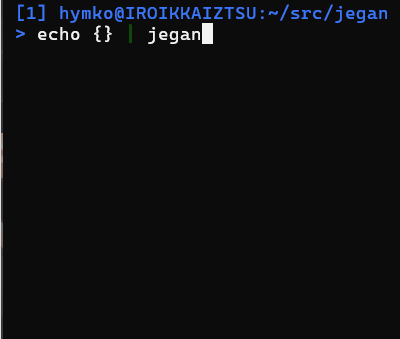

Jegan - A terminal JSON editor
==============================
( English / [Japanese](README_ja.md) )



Install
-------

### Manual Installation

Download the binary package from [Releases](https://github.com/hymkor/jegan/releases) and extract the executable.

> &#9888;&#65039; Note: The macOS build is experimental and not yet tested.
> Please let us know if you encounter any issues!

<!-- go run github.com/hymkor/example-into-readme/cmd/how2install@latest | -->

### Use [eget] installer (cross-platform)

```sh
brew install eget        # Unix-like systems
# or
scoop install eget       # Windows

cd (YOUR-BIN-DIRECTORY)
eget hymkor/jegan
```

[eget]: https://github.com/zyedidia/eget

### Use [scoop]-installer (Windows only)

```
scoop install https://raw.githubusercontent.com/hymkor/jegan/master/jegan.json
```

or

```
scoop bucket add hymkor https://github.com/hymkor/scoop-bucket
scoop install jegan
```

[scoop]: https://scoop.sh/

### Use "go install" (requires Go toolchain)

```
go install github.com/hymkor/jegan@latest
```

Note: `go install` places the executable in `$HOME/go/bin` or `$GOPATH/bin`, so you need to add this directory to your `$PATH` to run `jegan`.
<!-- -->

Usage
-----

```
jegan some.json
```

or

```
jegan < some.json
```

Key bindings
------------

- `j`, `↓` : Move to the next item
- `k`, `↑` : Move to the previous item
- `<` : Move to the first item
- `>` : Move to the last item
- `o` : Insert a new item below the cursor.
  - For object items, enter both key and value.
  - For array items, enter only the value.
  - The key is used as entered (no quotes required).
  - The value is interpreted as follows:
    - `"..."` → string (escape sequences are interpreted)
    - Input that can be parsed as a number → number
    - `null` → null
    - `true` / `false` → boolean
    - `{}` → empty object
    - `[]` → empty array
    - Otherwise → string (used as-is)
  - Ctrl+G cancels the current input
  - Empty input is treated as an empty string (`""`).
  - Duplicate keys in objects are not allowed.
- `r` : Modify the item at the cursor (same input method as `o`)
- `R` : Modify the item at the cursor (explicitly specify the value type)
- `d` : Delete the item at the cursor  
  Non-empty objects and arrays cannot be deleted
- `w` : Save to file
- `q` : Quit

Note on JSON Formatting
-----------------------

The formatting of loaded JSON is partially preserved when saving. The following rules apply:

* Line endings (LF or CRLF) and indentation style (number and type of whitespace, spaces or tabs) are detected from the first two lines and reused when saving.
* The presence or absence of a trailing newline at EOF is preserved.
* The order of object keys is preserved.

However, some formatting details are normalized:

* A single space is always inserted after `:` before the value.
* A newline is inserted after `,` (except for JSON that contains no newlines at all).
* A newline is inserted after `[` or `{` if the array or object has one or more elements
  (except for single-line JSON or empty arrays/objects).

Changelog
---------

- [English](CHANGELOG.md)
- [Japanese](CHANGELOG_ja.md)

Author
------

- [HAYAMA Kaoru](https://github.com/hymkor)
