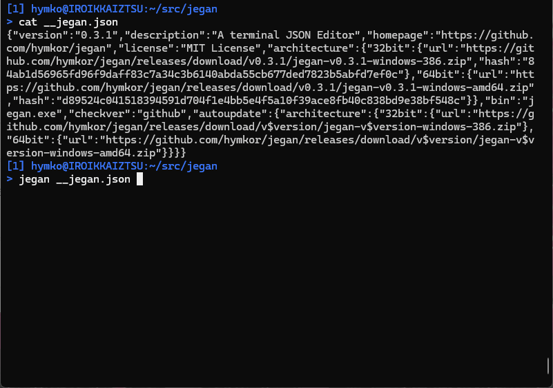

Jegan - ターミナル用JSONエディター
==================================
<!-- go run github.com/hymkor/example-into-readme/cmd/badges@latest | -->
[](https://github.com/hymkor/jegan/actions/workflows/go.yml)
[](https://github.com/hymkor/jegan/blob/master/LICENSE)
[](https://pkg.go.dev/github.com/hymkor/jegan)
[](https://github.com/hymkor/jegan)
<!-- -->
( [English](README.md) / Japanese )



特徴
----

### 🛡 元の JSON の書式をそのまま保持

Jegan は、読み込んだ JSON の表現を可能な限りそのまま維持します。
ユーザが変更した部分だけが書き換えられます。

* キーの順序を保持
* 空白、インデント、改行コードを保持
* 文字列の表現（`\uXXXX` かそのままか）を保持
* JavaScript ラッパーなどの非JSON部分も含めて再現


### ✏️ 必要最小限の安全な変更

* 変更された項目のみを書き換え
* 変更された項目はボールドで表示
* 新規追加時も周囲の書式に合わせて整形
* 保存時にはバックアップを作成

### 🔄 Undo による安全な編集

* `u` キーで直前の変更を元に戻せる
* 値の置換（`r`, `R` など）を undo 可能
* 削除操作も undo 可能

削除された項目はすぐには消えず、`<DEL>` として表示されます：

* `<DEL>` の項目は `u` で復元可能
* 保存時には `<DEL>` の項目は出力されず、削除が確定

### 🧩 折りたたみ表示

* `z` キーでオブジェクト・配列の折りたたみ／展開を切り替え
* 折りたたまれた要素は1行で表示される

### 📦 実務で使われる形式に対応

* JSON
* JSON Lines (JSONL)
* JSON を代入する形式の JavaScript（例：X/Twitter アーカイブ）

### 🧭 ターミナルでの構造的なナビゲーション

* `j` / `k` で項目単位の移動
* 長い行は左右スクロールで表示
* ステータス行に JSON パスと現在の値を表示
* `/`, `?`, `n`, `N` による検索

### 🔌 CLI との親和性

* ファイル・標準入力の両方に対応
* ファイル・標準出力の両方に出力可能
* フィルタとして利用可能：

```
jegan < input.json > output.json
```

### ⌨️ 効率的な編集操作

* vi ライクな移動操作
* Emacs 風 readline による入力編集

インストール
-----------

### Manual Installation

[Releases](https://github.com/hymkor/jegan/releases) よりバイナリパッケージをダウンロードして、実行ファイルを展開してください

> &#9888;&#65039; Note: macOS用バイナリは実験的ビルドで、検証できていません。
> もし何らかの問題を確認されましたらお知らせください！

<!-- go run github.com/hymkor/example-into-readme/cmd/how2install@latest ja | -->

### [eget] インストーラーを使う場合 (クロスプラットフォーム)

```sh
brew install eget        # Unix-like systems
# or
scoop install eget       # Windows

cd (YOUR-BIN-DIRECTORY)
eget hymkor/jegan
```

[eget]: https://github.com/zyedidia/eget

### [scoop] インストーラーを使う場合 (Windowsのみ)

```
scoop install https://raw.githubusercontent.com/hymkor/jegan/master/jegan.json
```

もしくは

```
scoop bucket add hymkor https://github.com/hymkor/scoop-bucket
scoop install jegan
```

[scoop]: https://scoop.sh/

### "go install" を使う場合 (要Go言語開発環境)

```
go install github.com/hymkor/jegan/cmd/jegan@latest
```

`go install` は `$HOME/go/bin` もしくは `$GOPATH/bin` へ実行ファイルを導入するので、`jegan` を実行するにはそのディレクトリを `$PATH` に追加する必要があります。
<!-- -->

起動方法
--------

```
jegan some.json
```

もしくは

```
jegan < some.json
```

キー操作
--------

- `j`, `↓`, `Ctrl-N` : 次の項目へ移動
- `k`, `↑`, `Ctrl-P` : 前の項目へ移動
- `l`, `→`, `Ctrl-F` : 表示範囲を右にスクロール
- `h`, `←`, `Ctrl-B` : 表示範囲を左にスクロール
- `0`, `^` : 表示範囲をリセット(0 カラム目へ移動)
- `Space`, `PageDown` : 次のページへ移動
- `b`, `PageUp`       : 前のページへ移動
- `<` : 最初の項目へ移動
- `>` : 最後の項目へ移動
- `/` : 前方検索
- `?` : 後方検索
- `n` : 同方向へ再検索
- `N` : 反対方向へ再検索
- `z` : 折り畳み / 展開表示を切り替え
- `o` : カーソル行の下へ項目を追加。
  - オブジェクトの項目の場合はキーと値を入力する
  - 配列の項目の場合は値のみを入力する
  - キーは入力された文字列をそのまま使用する（二重引用符不要）
  - 値の型は入力内容に応じて次のように解釈する
    - `"..."` → 文字列（エスケープ文字を解釈）
    - *数値として解釈できるもの* → 数値
    - `null` → null
    - `true` / `false` → 真偽値
    - `{}` → 空のオブジェクト
    - `[]` → 空の配列
    - *上記以外* → 文字列（そのまま解釈）
  - Ctrl+G 押下で項目追加をキャンセルできます。
  - 空入力は空文字列（`""`）として扱われる
  - オブジェクトのキーは重複できない
- `r` : カーソル行の項目を変更する（入力方法は `o` と同じ）
- `R` : カーソル行の項目を変更する（値の型を明示的に指定する）
- `d` : カーソル行の項目を削除する。
  ただし、空ではないオブジェクト・配列は削除できない
- `u` : UNDO
- `Ctrl-C` : JSONパスと値をクリップボードへコピーする
- `w` : ファイルへ保存
- `q` : 終了

環境変数
--------

### RUNEWIDTH\_EASTASIAN

Unicode で「曖昧幅」とされる文字の表示桁数を明示的に指定します。

- 2桁幅にする場合：`set RUNEWIDTH_EASTASIAN=1`
- 1桁幅にする場合：`set RUNEWIDTH_EASTASIAN=0`（`1` 以外の任意の1文字以上で可）

### GOREADLINESKK

環境変数 `GOREADLINESKK` に辞書ファイルを指定すると、[go-readline-skk] を利用した内蔵 SKK かな漢字変換[^SKK]が有効になります。

- **Windows**
  - `set GOREADLINESKK=SYSTEMJISYOPATH1;SYSTEMJISYOPATH2...;user=USERJISYOPATH`
  - 例:
    `set GOREADLINESKK=~/Share/Etc/SKK-JISYO.L;~/Share/Etc/SKK-JISYO.emoji;user=~/.go-skk-jisyo`
- **Linux**
  - `export GOREADLINESKK=SYSTEMJISYOPATH1:SYSTEMJISYOPATH2...:user=USERJISYOPATH`

（注）`~` は Windows の `cmd.exe` 上でもアプリ側で `%USERPROFILE%` に自動展開されます。

[^SKK]: Simple Kana to Kanji conversion program. One of the Japanese input method editors.

[go-readline-skk]: https://github.com/nyaosorg/go-readline-skk

Changelog
---------

- [English](CHANGELOG.md)
- [Japanese](CHANGELOG_ja.md)

Acknowledgements
----------------

- [rinodrops (Rino)](https://github.com/rinodrops)

Author
------

- [HAYAMA Kaoru](https://github.com/hymkor)
